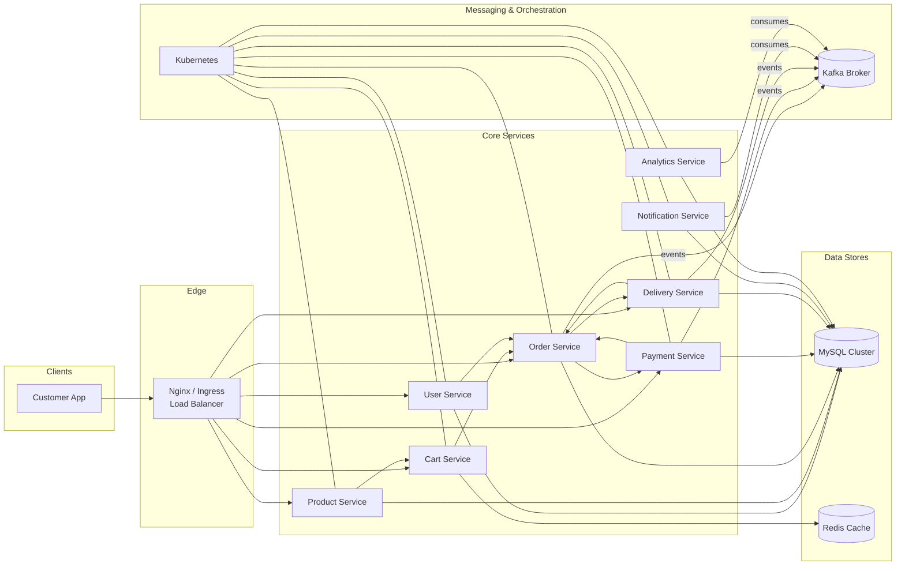

# Food Delivery Management System

## Problem Statement

Customers place food orders from local restaurants and expect clear updates from order placement to delivery. Restaurants and delivery workers need a system that handles menus, orders, and delivery tasks without manual coordination. The system must support independent services with reliable communication.

## Objectives

- Receive and update food orders through clear status steps.
- Assign delivery workers and update delivery progress.
- Send notifications to customers and delivery workers at key events.
- Keep services independent and scalable.
- Manage restaurant menus and availability.

## Proposed Architecture

The system consists of eight microservices communicating via REST for synchronous calls, with Kafka handling asynchronous event messaging:

1. User Service — manages user data (profiles, identities).
2. Product Service — manages restaurant products/menu items and availability.
3. Cart Service — maintains user carts prior to checkout.
4. Order Service — processes orders and updates order status.
5. Payment Service — handles payment transactions and confirmations.
6. Delivery Service — assigns drivers and tracks shipments/delivery progress.
7. Notification Service — sends real-time updates to customers and workers.
8. Analytics Service — aggregates events and operational metrics for insights.

Architecture sketch link: (add link here)

### Architecture Diagram

## Key Technologies

- Language: Node.js
- Database: MySQL
- Message Broker: Apache Kafka
- Cache: Redis
- API Documentation: Swagger / OpenAPI
- CI/CD: GitHub Actions
- Repository Structure: Monorepo
- Load Balancing & Rate Limiting: Nginx
- Containerization: Docker
- Orchestration: Kubernetes

## Risks and Mitigation

- Service failure: Use retries and request timeouts; implement health checks and circuit breakers.
- Message loss: Use Kafka acknowledgments and durable logging.
- Team coordination: Use clear role assignments, shared conventions, and frequent commits.
